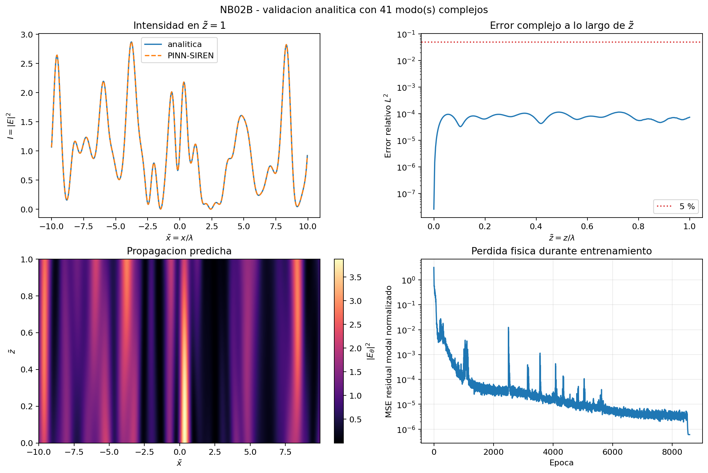
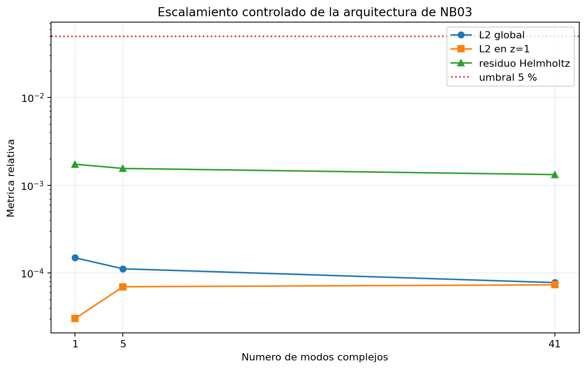

# PINN-SIREN para la ecuación de Helmholtz: validación 1D, 2D y modal

[](https://www.python.org/)
[](https://pytorch.org/)
[](https://developer.nvidia.com/cuda-toolkit)
[](LICENSE)

Redes Neuronales Informadas por Física con activación sinusoidal (SIREN)
aplicadas a la ecuación de Helmholtz, validadas **contra soluciones analíticas
exactas** en tres planteamientos de complejidad creciente.

> **Sobre el nombre del repositorio.** `pinn_speckle` es el nombre del proyecto
> de tesis completo, cuyo objeto final es el *speckle* óptico. Lo que aquí se
> publica es **la capa de validación** de ese trabajo: los experimentos que
> comprueban la arquitectura antes de aplicarla. Los resultados de *speckle* no
> forman parte de este repositorio.

> **Autor:** Roberto Hernández Estrada
> Maestría en Ciencias de la Computación, Universidad Juárez Autónoma de Tabasco
> **Director:** Dr. José Adán Hernández Nolasco · **Coasesor:** Dr. Noel Zacarías Morales

---

## Qué hay aquí, y qué no

Este repositorio contiene **la capa de validación** del trabajo: los tres
experimentos que comprueban que la arquitectura resuelve Helmholtz con
precisión, antes de aplicarla a un problema sin solución cerrada.

**No contiene** los resultados de *speckle* óptico, la extensión a tres
dimensiones, ni el manuscrito de la tesis. Tampoco hay **ninguna medida de
aceleración**: no se ha ejecutado la comparación contra elementos finitos, de
modo que este trabajo no afirma que el método sea más rápido que nada. Lo que
acredita es precisión y buen planteamiento.

---

## Resultados

Error $L^2$ relativo contra la solución analítica, evaluado en malla uniforme.
El umbral de aceptación, un error $L^2$ menor que el 5 %, es una decisión propia de
este trabajo: no existe un criterio estandarizado en la literatura de PINN.

| Experimento | Planteamiento | Error $L^2$ | Fuente |
|---|---|---:|---|
| **NB01** | Helmholtz 1D, Dirichlet, referencia $\cos(kx)$ | **0.006 %** | `results/multiseed_results.json` |
| **NB02** | Helmholtz 2D, campo complejo, onda plana en los 4 bordes | **0.171 %** | `results/ablation_lambda.json` |
| **NB02B** | Reducción modal, base de 41 modos, Cauchy por construcción | **0.0078 %** | `results/nb02b_modal_bridge/summary.json` |

**Cuidado al comparar esas tres cifras entre sí: resuelven problemas
distintos.** El 0.0078 % de la reducción modal no significa que esa
formulación sea 22 veces más precisa que la directa. NB02 es un problema de
contorno con onda plana impuesta en los cuatro bordes; NB02B es un problema de
Cauchy sobre una base de modos propagantes, con la condición inicial
satisfecha de forma algebraica. La cifra acota el error de la arquitectura
sobre soluciones cerradas, no una ventaja de un planteamiento sobre otro.

### Validaciones de base

Comprueban que la red no acierta por casualidad en un caso particular.

| Comprobación | Resultado |
|---|---|
| NB01 sobre la base fundamental | coseno 0.005517 %, seno 0.003090 % |
| NB02 en cuatro direcciones de propagación | media 0.1563 %, peor 0.1775 %, 4/4 aceptadas |
| NB02B, base fundamental por modo | coseno 0.004965 %, seno 0.007914 %, combinación compleja 0.008287 % |
| NB02B al enriquecer la base | 1 modo 0.0149 % → 5 modos 0.0112 % → 41 modos 0.0078 % |

Que el error **baje** al pasar de 1 a 41 modos indica que la base más rica
facilita el ajuste en lugar de dificultarlo.

**Dos honestidades sobre el cuadro anterior.** Las cuatro direcciones de NB02
son un conjunto controlado para una magnitud fija $|k_x|=|k_y|=k/\sqrt{2}$, no
una base completa de las soluciones 2D; así lo declara el propio
`scope_note` del resumen. Y de esas cuatro, la dirección de 45° reutiliza el
punto de control canónico de NB02 en vez de entrenarse en frío: sólo las otras
tres son corridas independientes.

### Figuras de NB02B

Las ocho están en `results/figures/`, con el prefijo `nb02b_`.



*Caso de 41 modos complejos.* Arriba a la izquierda, la intensidad en
$\tilde z = 1$: la curva de la red queda superpuesta a la analítica. Arriba a
la derecha, el error relativo a lo largo de $\tilde z$: parte de cero en
$\tilde z = 0$, donde la condición de Cauchy se cumple por construcción, y su
máximo es 0.0115 %, lejos del umbral de 5 % marcado con la línea punteada.
Abajo, la intensidad predicha en todo el dominio y la pérdida física durante el
entrenamiento. Los casos de
[1 modo](results/figures/nb02b_bridge_modes_01.png) y de
[5 modos](results/figures/nb02b_bridge_modes_05.png) tienen la misma
estructura.



*Métricas al enriquecer la base.* El error global baja de 0.0149 % con 1 modo
a 0.0078 % con 41. El error en $\tilde z = 1$, en cambio, sube de 0.0030 % a
0.0070 % al pasar de 1 a 5 modos y casi no cambia hasta 41 (0.0073 %). Todo
queda por debajo del umbral, y los errores $L^2$ por más de dos órdenes de
magnitud. El título de la figura menciona NB03 porque la red validada es la
misma `ModalSiren` que ese notebook emplea.

La base fundamental tiene una figura por caso
([coseno](results/figures/nb02b_basis_cosine.png),
[seno](results/figures/nb02b_basis_sine.png) y
[combinación compleja general](results/figures/nb02b_basis_general.png)) y un
[resumen](results/figures/nb02b_basis_summary.png). En el resumen, las barras
del error $L^2$ (entre 0.0050 y 0.0083 %) son demasiado pequeñas para verse a
esa escala; las que se ven son el residuo normalizado, entre 0.15 y 0.33 %.

### Dispersión frente a la semilla

Tres semillas $\{42, 123, 777\}$, medidas en la misma sesión:

```
L² = 0.192 % ± 0.089 %   →  coeficiente de variación del 46 %
```

La inicialización **sí** afecta la precisión final de forma apreciable. Las
tres corridas quedan aun así entre 16 y 53 veces por debajo del umbral.

---

## Decisiones que costaron trabajo averiguar

Están aquí porque cada una salió de un fallo real, y reproducirlas a ciegas es
lo que hace perder tiempo.

**$\omega_0 = 1$, no 30.** El valor de Sitzmann et al. para señales de imagen
hace explotar los gradientes cuando $k \approx 2\pi$. La regla que funciona es
$\omega_0 \approx k/(2\pi)$. El barrido lo genera
`scripts/experiments/omega0_spectral_sweep.py`, con datos en
`results/ntk_spectral_bias_diagnostics/`.

**$\omega_0$ no vive en el `state_dict`.** Es un atributo fijado al construir
la capa. Reconstruir una red con $\omega_0=30$ y cargarle pesos entrenados con
$\omega_0=1$ da una función distinta, **sin ningún error visible** y con
métricas silenciosamente equivocadas. En NB02B ocurrió: una corrida entera
validó la variante de $\omega_0=30$, con un error 210 veces peor.

**$\lambda_{\text{física}} = 0.1$ en 2D, no 1.0.** Los dos residuos, real e
imaginario, duplican el peso efectivo de la física. Con 1.0 la corrida muere
por excepción de CUDA en `float32`; no es falta de convergencia, es fallo
numérico. Ver `results/ablation_lambda.json`.

**Nunca un planificador de tasa de aprendizaje antes de L-BFGS.** Lo mata: 7
iteraciones de 1000.

**Cinco puntos de frontera en 1D, no dos.** La condición simétrica
$E(0)=E(1)=1$ es consistente con la solución constante trivial, y la red
colapsa hacia ella. Los tres puntos intermedios rompen la simetría.

**Un residuo bajo no acredita una solución correcta.** Un planteamiento mal
puesto puede cumplir la ecuación a $10^{-14}$ y la frontera de forma exacta, y
aun así estar muy lejos de la solución verdadera: sin una condición que fije el
sentido de propagación, el problema admite infinitas soluciones. Validar
siempre contra una solución conocida, nunca sólo por el residuo. La medida de
cuánto se aleja pertenece a la parte del trabajo que este repositorio no
publica.

---

## Estructura

```
notebooks/     01, 02 y 02b — los tres experimentos, autocontenidos
src/           models, losses, training, utils — la arquitectura SIREN
scripts/       los guiones que generan cada .json de results/
results/       métricas, figuras y arreglos de cada corrida, incluidos los
               diagnósticos: barrido de ω₀, traza NTK, 4 capas frente a 5
```

**`scripts/experiments/nb03_modal_pinn_siren.py` lleva «nb03» en el nombre pero
hace falta aquí:** es donde vive la `ModalSiren` que el notebook `02b` importa
y valida. Ese módulo importa a su vez `nb03_pinn_slabs.py`, del que toma
constantes y utilidades. Sin esos dos archivos el `02b` no corre.

---

## Reproducir

```bash
conda env create -f environment.yml
conda activate pinn_speckle

jupyter lab notebooks/                              # los tres notebooks

python scripts/experiments/run_multiseed.py          # dispersión entre semillas
python scripts/experiments/run_ablation_lambda.py    # ablación del peso físico
python scripts/experiments/nb02_multidirectional_validation.py
python scripts/experiments/nb02b_modal_analytic_validation.py
python scripts/experiments/nb02b_modal_fundamental_basis_validation.py
```

Medido en GPU NVIDIA RTX 5050 de 8 GB. NB01 tarda unos 131 s y NB02 unos 210 s
con el equipo conectado a corriente y sin procesos concurrentes; en régimen
térmico degradado el mismo hardware reprodujo métricas idénticas a casi cinco
veces el tiempo, así que el tiempo no es comparable entre máquinas y la
precisión sí.

### Dos límites de reproducibilidad, declarados

1. **Varios `.json` de `results/` registran rutas absolutas** al equipo donde
   se entrenaron, y los pesos `.pt` no se publican. Las métricas son
   verificables y las corridas repetibles desde cero, pero el repositorio no
   reconstruye esos puntos de control concretos.
2. **`results/nb01_basis_validation/` no trae aquí el guion que lo generó.**
   Los otros resultados sí tienen el suyo listado arriba.

---

## Licencia

MIT, ver [LICENSE](LICENSE). El código y los resultados son propios; este
repositorio no redistribuye material de terceros.
