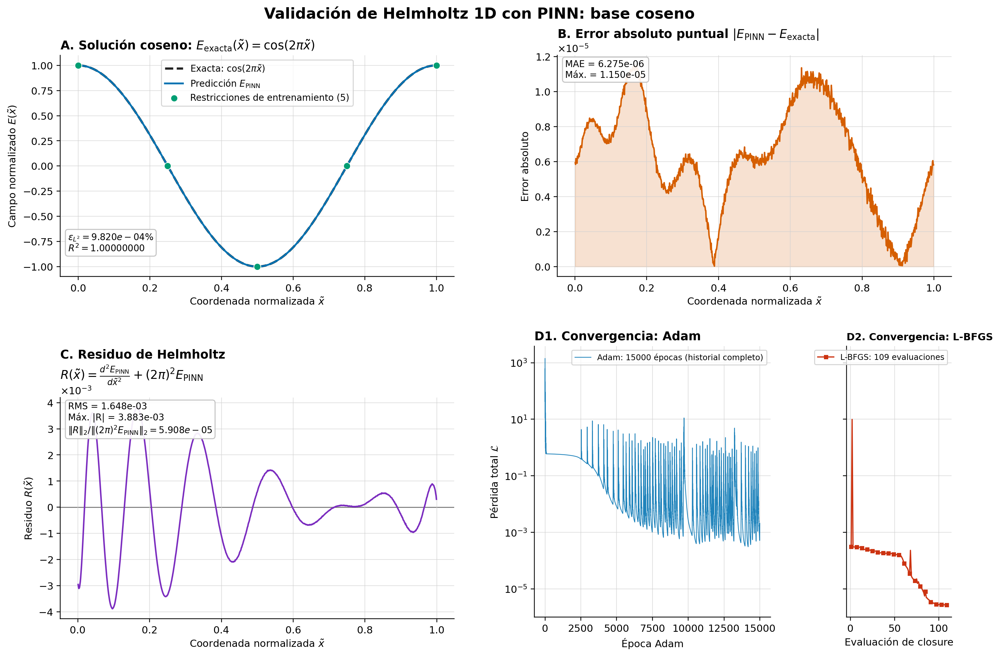
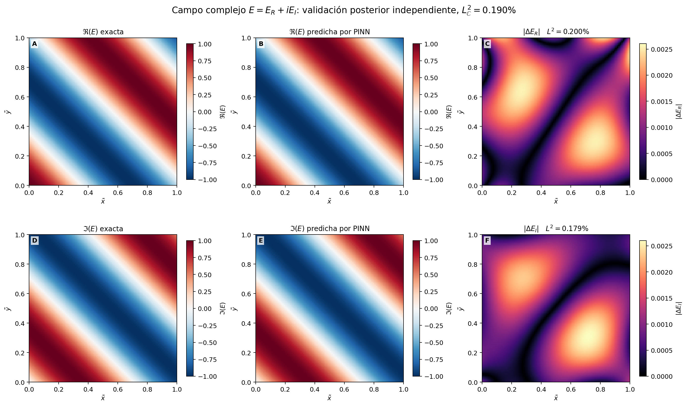
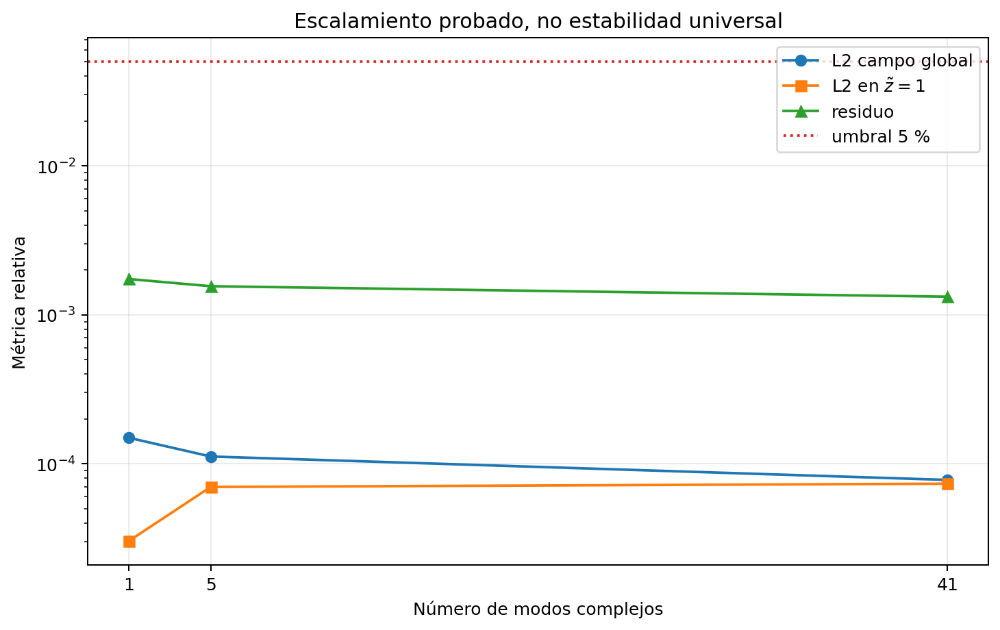

# PINN-SIREN para la ecuacion de Helmholtz

Repositorio publico de las validaciones computacionales NB01, NB02 y NB02B de
la tesis de maestria de Roberto Hernandez Estrada, Universidad Juarez Autonoma
de Tabasco.

El proyecto estudia redes neuronales informadas por fisica (PINN) con
activaciones sinusoidales (SIREN) para resolver la ecuacion de Helmholtz y
validar una arquitectura modal destinada a etapas posteriores de propagacion
optica.

## Estado del proyecto

Los tres notebooks incluidos alcanzaron cierre computacional reproducible:

| Notebook | Alcance | Estado |
|---|---|---|
| [NB01](notebooks/01_validacion_helmholtz_1d_normalizada.ipynb) | Helmholtz 1D, casos coseno y seno entrenados como redes independientes | Cerrado |
| [NB02](notebooks/02_validacion_helmholtz_2d_normalizada.ipynb) | Campo complejo 2D y robustez en cuatro direcciones controladas | Cerrado |
| [NB02B](notebooks/02b_validacion_puente_arquitectura_modal_nb03.ipynb) | Base modal, escalamiento de 1, 5 y 41 modos, y comparacion de formulaciones de frontera | Cerrado |

Para cada notebook se verificaron:

- ejecucion secuencial `FULL_REBUILD`;
- ejecucion posterior `LOAD_ONLY`;
- regeneracion programatica de figuras;
- procedencia de checkpoints, JSON, NPZ e historiales;
- igualdad entre el contrato de artefactos esperados y los artefactos locales;
- ausencia de metricas o historiales fabricados.

"Cerrado" significa que el experimento no debe modificarse salvo que aparezca
un error cientifico demostrable, una inconsistencia reproducible o un cambio
explicito de alcance.

## Formulacion fisica

Los experimentos parten de la ecuacion de Helmholtz

```math
\nabla^2 E + k^2 E = 0.
```

NB01 valida en una dimension las soluciones reales

```math
E_c(x)=\cos(kx), \qquad E_s(x)=\sin(kx),
```

mediante dos redes independientes. NB02 representa una sola solucion compleja

```math
E(x,y)=E_R(x,y)+iE_I(x,y)
      =\exp\!\left[i(k_xx+k_yy)\right],
```

con una red de dos salidas para las componentes real e imaginaria. NB02B valida
la reduccion modal

```math
E(\tilde{x},\tilde{z})
=\sum_m a_m(\tilde{z})\exp(i\tilde{k}_{x,m}\tilde{x}),
```

donde cada coeficiente satisface

```math
a_m''+\tilde{k}_{z,m}^{,2}a_m=0,
\qquad
\tilde{k}_{z,m}^{,2}=\tilde{k}^{,2}-\tilde{k}_{x,m}^{,2}.
```

## Resultados principales

| Experimento | Resultado de la corrida de cierre |
|---|---|
| NB01, coseno | Error relativo L2: 0.000982 % |
| NB01, seno | Error relativo L2: 0.003574 % |
| NB02, caso principal complejo | Error relativo L2: 0.189683 % |
| NB02, cuatro direcciones | Media: 0.164048 %; peor caso: 0.191505 % |
| NB02B, base modal | Tres casos aceptados; peor error relativo del coeficiente: 0.008287 % |
| NB02B, puente modal | Casos de 1, 5 y 41 modos aceptados; peor error global: 0.014925 % |

El criterio principal de aceptacion es un error relativo L2 menor que 5 %. Los
valores completos, residuos, correlaciones, errores de fase, hashes y metadatos
de entorno se encuentran en:

- [results/nb01/validation_summary.json](results/nb01/validation_summary.json)
- [results/nb02/validation_summary.json](results/nb02/validation_summary.json)
- [results/nb02b/validation_summary.json](results/nb02b/validation_summary.json)

## Visualizaciones

### NB01: validacion 1D



### NB02: validacion del campo complejo 2D



### NB02B: puente modal



Todas las figuras son salidas producidas por codigo dentro del notebook
correspondiente. Ningun notebook carga un PNG preexistente como sustituto de
una visualizacion calculada.

## Estructura publicada

```text
.
|-- notebooks/
|   |-- 01_validacion_helmholtz_1d_normalizada.ipynb
|   |-- 02_validacion_helmholtz_2d_normalizada.ipynb
|   `-- 02b_validacion_puente_arquitectura_modal_nb03.ipynb
|-- results/
|   |-- nb01/
|   |-- nb02/
|   `-- nb02b/
|-- src/
|   |-- modal/
|   `-- models.py
|-- .gitignore
`-- README.md
```

`results/` contiene snapshots JSON, historiales y figuras derivados de los
notebooks. NB01 y NB02 incluyen sus checkpoints principales seleccionados. Los
checkpoints y arreglos NPZ de NB02B permanecen fuera del repositorio publico,
pero el notebook contiene el entrenamiento y las instrucciones de persistencia
que los regeneran.

## Modos de ejecucion

Cada notebook implementa dos modos:

- `FULL_REBUILD`: entrena desde cero y regenera los artefactos canonicos.
- `LOAD_ONLY`: carga artefactos propios, recalcula la evaluacion y regenera las
  figuras sin reentrenar.

Las variables de entorno son `NB01_MODE`, `NB02_MODE` y `NB02B_MODE`. Por
ejemplo, en PowerShell:

```powershell
$env:NB01_MODE = "LOAD_ONLY"
jupyter notebook notebooks/01_validacion_helmholtz_1d_normalizada.ipynb
```

Para reconstruir NB02B desde un clon nuevo, donde sus binarios regenerables no
estan versionados:

```powershell
$env:NB02B_MODE = "FULL_REBUILD"
jupyter notebook notebooks/02b_validacion_puente_arquitectura_modal_nb03.ipynb
```

El entorno de las corridas de cierre registro Python 3.14, PyTorch 2.11 con
CUDA 12.8 y una GPU NVIDIA GeForce RTX 5050 Laptop. Los tiempos observados en
ese equipo fueron aproximadamente 10.8 minutos para NB01, 37.3 minutos para
NB02 y 32.0 minutos para NB02B. No deben interpretarse como benchmarks frente a
otros metodos numericos.

## Politica de artefactos

El repositorio publica codigo, notebooks ejecutados, resultados estructurados y
figuras cientificas. Los binarios grandes o regenerables se excluyen de forma
selectiva mediante `.gitignore`.

El notebook es la fuente computacional primaria. Los archivos JSON son
snapshots derivados y auditables. Una figura PNG es siempre una salida, nunca
una entrada cientifica del notebook.

## Alcance y limitaciones

- Las cuatro direcciones de NB02 son una prueba controlada de robustez, no una
  base completa de todas las soluciones de Helmholtz 2D.
- Los casos de 1, 5 y 41 modos de NB02B validan escalamiento controlado, no un
  numero arbitrario de modos.
- NB02B no demuestra estabilidad universal del problema de Cauchy ni cubre
  modos evanescentes en el puente publicado.
- Este repositorio no presenta validacion experimental.
- No se afirma superioridad de velocidad frente a FEM u otros metodos.

## Clonado

```bash
git clone https://github.com/RobertoEstradah/pinn_speckle.git
cd pinn_speckle
jupyter notebook
```

Antes de ejecutar un `FULL_REBUILD`, instale una version de PyTorch compatible
con su CPU o GPU, ademas de NumPy, SciPy, Matplotlib, scikit-learn y Jupyter.

