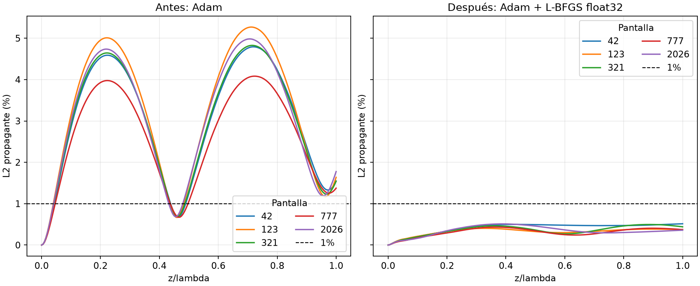

# NB03: confirmación de L-BFGS float32 en cinco pantallas

Se completó el mismo protocolo en las pantallas 321, 777 y 2026 y se combinaron
con el piloto 42/123. Cada corrida continúa sus propios pesos de 8000 épocas Adam.

| Pantalla | Propagante antes | Propagante después | Máximo propagante después | Completo después | RMSE modal | Segundos adicionales |
|---:|---:|---:|---:|---:|---:|---:|
| 42 | 1.5443% | 0.5145% | 0.5145% | 3.8529% | 0.01050 | 60.39 |
| 123 | 1.6367% | 0.3740% | 0.4041% | 2.4300% | 0.01001 | 60.17 |
| 321 | 1.5466% | 0.4412% | 0.4967% | 3.5996% | 0.00974 | 60.51 |
| 777 | 1.3758% | 0.3719% | 0.4340% | 2.9701% | 0.00993 | 60.28 |
| 2026 | 1.7761% | 0.3590% | 0.5116% | 3.0844% | 0.00960 | 60.31 |

Error propagante final medio: 0.4121%.
Error completo final medio: 3.1874%.
Tiempo adicional acumulado: 301.66 s (no incluye los entrenamientos Adam anteriores).

## Interpretación y límites

- Las referencias completa y propagante se identifican por separado.
- El campo completo conserva componentes evanescentes ausentes en los 41 modos de la red.
- Los máximos se refieren a 201 planos; no son cotas continuas ni máximos del error completo.
- La selección de pesos usa únicamente residuo físico en 997 puntos fijos; la prueba usa 2001 puntos.
- Se conservaron las condiciones de Cauchy de la entrada proyectada.
- Las cinco pantallas son conocidas, cada una tiene su propio entrenamiento y la semilla de red sigue fija.
- El umbral exploratorio de fidelidad de contraste no reemplaza la hipótesis original contra C=1.
- No se incorporaron evanescentes ni se ensayaron nuevas distancias, FEM o mediciones ópticas.

## Reproducción

Desde la raíz del proyecto:

```powershell
python -u scripts/experiments/nb03_modal_refinement.py --seeds 321 777 2026 --arms lbfgs32 --seconds 60 --name replica_confirmation
```

El nombre de salida debe ser nuevo. Los resultados originales están en `confirmation3`.
La consolidación lee `pilot1` y `confirmation3`:

```powershell
python scripts/experiments/nb03_refinement_summary.py
```

Se verificaron los NPZ frente a las métricas JSON y los hashes de los modelos históricos.
Configuraciones, modelos, versiones y trazabilidad: [summary.json](summary.json).


