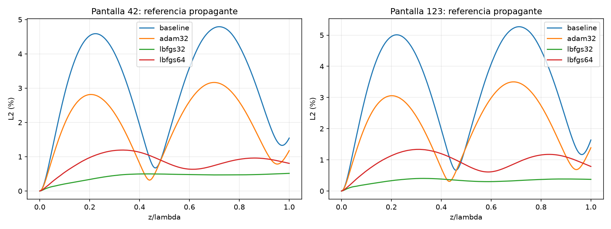

# NB03: afinación controlada con Adam y L-BFGS

Resultado: L-BFGS en float32 fue la mejor variante en las dos pantallas
estudiadas, con aproximadamente 60 segundos adicionales de CPU por pantalla.
Se mantuvieron SIREN 4x128, 41 modos propagantes, Helmholtz y Cauchy dura.

## Protocolo

- Punto de partida: pesos finales de 8000 épocas Adam guardados anteriormente
  para las pantallas 42 y 123. Cada brazo parte del mismo modelo de su pantalla.
- CPU, 4 hilos. Tres brazos independientes: Adam float32, L-BFGS float32 y
  L-BFGS float64. El estado del optimizador se reinicia en todos.
- Presupuesto: 60 s por brazo; un paso en curso puede terminar después del
  límite. Incluye entrenamiento y selección periódica, no evaluación final.
- Colocación: 1024 puntos fijos, centros de intervalos uniformes en [0,1].
- Selección: 997 puntos uniformes aleatorios fijos (generador NumPy 1717),
  evaluados después de actualizar los pesos. Se incluye el modelo inicial.
- Prueba final del residuo: 2001 puntos independientes de la selección.
- Campo: 201 planos en z, cada uno con 1024 puntos transversales.
- No se utilizan campos del espectro angular para entrenar o seleccionar.
- L-BFGS: lr=1, max_iter=10 por llamada, max_eval=15, history_size=50,
  strong_wolfe, tolerance_grad=1e-10, tolerance_change=1e-12.
- Adam: lr desde 5e-5 hasta 1e-6 con descenso coseno según tiempo transcurrido,
  recorte de norma del gradiente a 1. Selección cada 10 pasos y al final.
- Float64 convierte pesos y buffers originales; no recupera precisión perdida
  al generar las condiciones de frontera históricas en float32.

Este es un ensayo de continuación desde modelos ya afinados, no una comparación
de tres entrenamientos desde cero. Un presupuesto temporal también implica
distinto número de actualizaciones en otra máquina.

## Resultados

| Pantalla | Variante | L2 propagante final | Máximo propagante en 201 planos | L2 completo final | RMSE modal de prueba | Tiempo adicional |
|---:|---|---:|---:|---:|---:|---:|
| 42 | Modelo previo | 1.5443 % | 4.7926 % | 4.1184 % | 0.03835 | — |
| 42 | Adam float32 | 1.1776 % | 3.1662 % | 3.9956 % | 0.03089 | 60.16 s |
| 42 | **L-BFGS float32** | **0.5145 %** | **0.5145 %** | **3.8529 %** | **0.01050** | **60.39 s** |
| 42 | L-BFGS float64 | 0.8066 % | 1.1947 % | 3.9025 % | 0.01409 | 60.25 s |
| 123 | Modelo previo | 1.6367 % | 5.2700 % | 2.9056 % | ~0.0367 | — |
| 123 | Adam float32 | 1.3884 % | 3.5006 % | 2.7734 % | 0.02953 | 60.15 s |
| 123 | **L-BFGS float32** | **0.3740 %** | **0.4041 %** | **2.4300 %** | **0.01001** | **60.17 s** |
| 123 | L-BFGS float64 | 0.7881 % | 1.3352 % | 2.5270 % | 0.01385 | 60.65 s |

Valores exactos, configuración, tiempos, versiones, SHA256 de entradas y
trayectoria de selección: [summary.json](summary.json).

Los máximos son sobre la malla evaluada, no una cota matemática continua.
El residuo es modal, normalizado por k² por la amplitud de cada modo; no
equivale a un porcentaje de error del campo. Su máximo absoluto sigue siendo
0.27985 (pantalla 42) y 0.26335 (123) con L-BFGS float32: queda margen para
mejorar la precisión local aun cuando el RMSE es mucho menor.

## Interpretación física

Los límites por omitir evanescentes son 3.8184 % (42) y 2.4011 % (123).
La afinación se acerca a esos límites. La disminución del error neuronal es
mucho mayor que la del error completo porque la representación no incluye
las componentes evanescentes de la referencia completa.

El campo propagante final mejora aproximadamente 3 veces (42) y 4.4 veces
(123) respecto a los modelos anteriores. Las condiciones de Cauchy sobre el
campo proyectado se conservan con diferencia numérica cero en los coeficientes.

El contraste final L-BFGS float32 es 0.90190 y 0.88311 respectivamente, frente
a referencias completas 0.90634 y 0.88270. La pantalla 123 sigue sin cumplir
|C-1|<0.1; el contraste de su referencia tampoco cumple esa regla. El ensayo
reporta ambas cantidades sin convertir esta observación en una validación
de la hipótesis estadística original.

En el presupuesto temporal probado, float64 hizo menos reevaluaciones:
841/840 frente a 1204/1216 de float32. No se concluye que float32 tenga una
precisión límite superior a float64; solo rindió mejor en este ensayo de CPU.

## Reproducción

Desde la raíz, con el entorno que contiene NumPy, PyTorch y Matplotlib:

```powershell
python -u scripts/experiments/nb03_modal_refinement.py --seconds 60 --seeds 42 123 --name replica1
```

En esta máquina se utilizó el intérprete:

```powershell
& 'C:\Users\rober\.cache\codex-runtimes\codex-primary-runtime\dependencies\python\python.exe' -u scripts/experiments/nb03_modal_refinement.py --seconds 60 --seeds 42 123 --name replica1
```

El nombre de salida debe ser nuevo: el programa rechaza sobrescribir un ensayo.
Los PT guardan pesos y buffers; los NPZ contienen campos completos, propagantes,
predicción y curvas con referencias explícitas. Para cargar los pesos float64,
crear el modelo con la misma arquitectura y convertirlo a double antes de
cargar el state_dict, para evitar reconvertirlos a float32.

## Verificación y alcance

Se comprobó Cauchy en valor y derivada, finitud del campo, identidad de errores
por proyección Fourier, correspondencia entre pesos guardados y la puntuación
de selección. Una comprobación adicional comparó el residuo JVP con segundas
derivadas por autograd inverso en seis componentes y tres coordenadas; coincidió
con tolerancia absoluta 1e-9 en float64.

La comparación favorece L-BFGS float32 en dos pantallas conocidas. Faltan las
tres pantallas restantes y luego casos reservados para confirmar robustez. No
se cambiaron NB01, NB02, la tesis ni los modelos históricos. El método completo
todavía resuelve una entrada proyectada: no se ha validado la pantalla completa
en todo 0<=z<=1, ni distancias mayores o aceleración frente a FEM.


